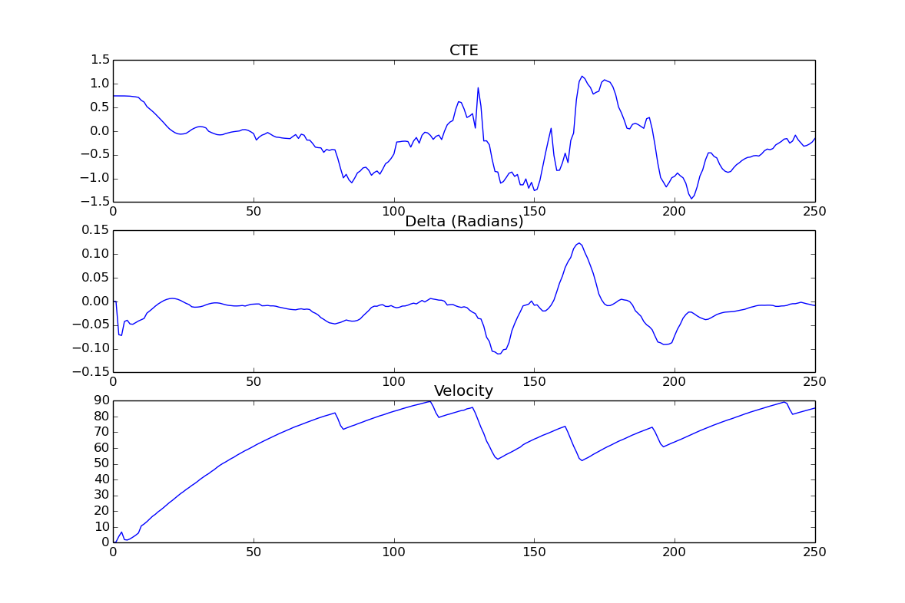

# CarND-Controls-MPC
Self-Driving Car Engineer Nanodegree Program

---

[](http://www.udacity.com/drive)

The project contains a Model Predictiv Controler (MPC) that controls a vehicle lognitudinal and lateral behaviour by getting the Cross Track Error (CTE) of the posisition and the rotation error from a simulator and calculating out from there with costfunctions the desired balanced driving path for the feature steps. So the challenge here contain folowing steps. 
* Implementing the MPC in C++:
    1) Transforming the simulation global input to vehicle cordinates 
    2) Creating Cross Track Error
    3) Compensate the System-Latency (100ms)
    5) Model Update (Kinematic Equations)
    6) Create Model Constrains
* Tuning the Costfunction for a smooth path
    1) Costfuntions 
    1) Plotting Errors for Debugging and tuning 
    
---
# 1) Function Development
In the folllowing are the high lights of the project are presented for on overview. For more details feel free to check the code. 

### 1.1 Translation & Rotation 
The car posistion is given in global cordination. To transform them into car cordination a translation and rotaion is done by these [equation](// http://planning.cs.uiuc.edu/node99.html)
 
 ```c
   for (int i = 0; i < ptsx.size(); i++) {
            double x_shift = ptsx[i] - px;
            double y_shift = ptsy[i] - py;
            
            // http://planning.cs.uiuc.edu/node99.html
            car_points_x.push_back(x_shift * cos(psi) + y_shift * sin(psi));
            car_points_y.push_back(y_shift * cos(psi) - x_shift * sin(psi));
          }
```

###  1.2 Calculating CTE & Rotaion Error
We can express the error between the center of the road and the vehicle's position as the cross track error (CTE).  Assuming the reference line is a polynomial f, f(xt)f(x_t) f(xt​) is our reference line and our CTE at the current state is defined as:

-y_{t}\])

ctet=f(xt)−ytcte_t = f(x_t) - y_t ctet​=f(xt​)−yt

 ```c
          // Fit 3rd order polynomials to waypoints. Fits most streets
          auto coeffs = polyfit(car_points_x_eigen, car_points_y_eigen, 3);

          // Cross Track Error CTE
          // positive value: too far to the right, negative too far to the left
          double cte = polyeval(coeffs, 0);

          // positive value: to far to the left, negative too far to the right
          double epsi = -atan(coeffs[1]);
```

### 1.3 Latency
In a real car, an actuation command won't execute instantly - there will be a delay as the command propagates through the system. A realistic delay might be on the order of 100 milliseconds. (This is also integreated into the simulator to make it as realistic as possible)
This is a problem called "latency", and it's a difficult challenge for some controllers - like a PID controller - to overcome. But a Model Predictive Controller can adapt quite well because we can model this latency in the system. A contributing factor to latency is actuator dynamics. For example the time elapsed between when you command a steering angle to when that angle is actually achieved. This could easily be modeled by a simple dynamic system and incorporated into the vehicle model.  To overcome this, the vehicle model calculates the fitting state after the latency. So that the actuator actually dont have a latency.

Thus, MPC can deal with latency much more effectively, by explicitly taking it into account, than a PID controller.

Here the code for the start of the prediction of the MPC, to overcome the latency:
```c
dt = 0.1;
x1    = v * cos(0) * dt;
y1    = v * sin(0) * dt;
psi1  = - v/Lf * steer_value * dt;
v1    = throttle_value * dt;
cte1  =   v * sin(epsi1) * dt;
epsi1 = - v * steer_value / Lf * dt;	
```

### 1.4 Prediction Horizon

The prediction horizon is the duration over which future predictions are made. We’ll refer to this as T. T is the product of two other variables, ``N`` and ``dt``. ``N`` is the number of timesteps in the horizon. ``dt`` is how much time elapses between actuations. A good setting with the first shoot is  ``N`` were 10 and ``dt`` were 0.1, then T would be 1 seconds. A general guidline is that T should be as large as possible, while ``dt`` should be as small as possible. For this shoot dt=0.1 is choosen, since this is the latency time and we currently make no difference in the timesteps we calculate the the model.  And T bigger than 1s didnt show any improevements. 

MPC attempts to approximate a continuous reference trajectory by means of discrete paths between actuations. Larger values of dt result in less frequent actuations, which makes it harder to accurately approximate a continuous reference trajectory. This is sometimes called "discretization error".

### 1.5 State

The state consists of sytem variables and errors references: ``[x,y,psi,v,cte,epsi]``. ``x`` and ``y`` stand for the vehicle position, ``psi`` the vehicle orientation, ``v`` the vehicle speed and finally, ``cte`` and ``epsi`` stand for the cross track error and orientation error of the vehicle related to the reference.

### 1.6 Model (Update equations)

The followind equations updates the prediction model at every timestep:


``Lf`` measures the distance between the front of the vehicle and its center of gravity. ``f(x)`` is the evaluation of the polynomial ``f`` at point x and ``psidest`` is the tangencial angle of the polynomial ``f`` evaluated at x.

### 1.7 Constraints

The actuators constraints limits the upper and lower bounds of the steering angle and throttle acceleration/brake.


The goal of Model Predictive Control is to optimize the control inputs: [δ,a][\delta, a][δ,a]. An optimizer will tune these inputs until a low cost vector of control inputs is found. The length of this vector is determined by N:
 
 

## 2) Costfunctions & Tuning
 
 The cost functions are used to get a desired vehicle behaviour, designing this ones is difficult and getting to cooperate to produce a reasonable vehicle behaviour is hard. Some difficulties are to solve problems wiout unsolving the old ones. To make the results of the tuning visable plot, figure 2.1, is unsed. The CTE gradient shows a steady and fast changing error in the system. An further tweak of the related costfunction could smoothen the behaviour. Anyhow the car is most of the time quiet stabel with out big steering intervention, if thery are happening the transistion is smooth and never steep, thats positiv. In a further tuning the last small shakings between the 100 - 130 predictions scould be more adjused. Last but not least the car never stops and the velocity is ocelating in the upper third between 50-90 mph anyhow with steep changs. If desired in further tuning this could also be more adjust.
 


For this project, following cost functions are used:

```c

	//Cost related to the reference state.
	for (unsigned int t = 0; t < N; t++) {
		fg[0] += 10000*CppAD::pow(vars[cte_start + t], 2); 
		fg[0] += 10000*CppAD::pow(vars[epsi_start + t], 2); 
		fg[0] += 5*CppAD::pow(vars[v_start + t] - ref_v, 2); 
	}

	//Minimize the use of actuators.
	for (unsigned int t = 0; t < N - 1; t++) {
		//Increase the cost depending on the steering angle
	 	fg[0] += 250*CppAD::pow((vars[delta_start + t]/(0.436332*Lf))*vars[a_start + t], 2);
		fg[0] += 50*CppAD::pow(vars[delta_start + t], 2);
	}

	//Minimize the value gap between sequential actuations.
	for (unsigned int t = 0; t < N - 2; t++) {
		fg[0] += 5*CppAD::pow(vars[delta_start + t + 1] - vars[delta_start + t], 2); 
		fg[0] += 5*CppAD::pow(vars[a_start + t + 1] - vars[a_start + t], 2); 
	}
```

<figure>
 
 <figcaption>
 <p></p> 
 <p style="text-align: center;"> Fig. 2.1: Data Evaluation, CTE-Error, Steering angle delta and last vehicle velocity</p> 
 </figcaption>
</figure>
 <p></p>

## Dependencies

* cmake >= 3.5
 * All OSes: [click here for installation instructions](https://cmake.org/install/)
* make >= 4.1(mac, linux), 3.81(Windows)
  * Linux: make is installed by default on most Linux distros
  * Mac: [install Xcode command line tools to get make](https://developer.apple.com/xcode/features/)
  * Windows: [Click here for installation instructions](http://gnuwin32.sourceforge.net/packages/make.htm)
* gcc/g++ >= 5.4
  * Linux: gcc / g++ is installed by default on most Linux distros
  * Mac: same deal as make - [install Xcode command line tools]((https://developer.apple.com/xcode/features/)
  * Windows: recommend using [MinGW](http://www.mingw.org/)
* [uWebSockets](https://github.com/uWebSockets/uWebSockets)
  * Run either `install-mac.sh` or `install-ubuntu.sh`.
  * If you install from source, checkout to commit `e94b6e1`, i.e.
    ```
    git clone https://github.com/uWebSockets/uWebSockets
    cd uWebSockets
    git checkout e94b6e1
    ```
    Some function signatures have changed in v0.14.x. See [this PR](https://github.com/udacity/CarND-MPC-Project/pull/3) for more details.

* **Ipopt and CppAD:** Please refer to [this document](https://github.com/udacity/CarND-MPC-Project/blob/master/install_Ipopt_CppAD.md) for installation instructions.
* [Eigen](http://eigen.tuxfamily.org/index.php?title=Main_Page). This is already part of the repo so you shouldn't have to worry about it.
* Simulator. You can download these from the [releases tab](https://github.com/udacity/self-driving-car-sim/releases).
* Not a dependency but read the [DATA.md](./DATA.md) for a description of the data sent back from the simulator.


## Basic Build Instructions

1. Clone this repo.
2. Make a build directory: `mkdir build && cd build`
3. Compile: `cmake .. && make`
4. Run it: `./mpc`.

## Tips

1. The MPC is recommended to be tested on examples to see if implementation behaves as desired. One possible example
is the vehicle offset of a straight line (reference). If the MPC implementation is correct, it tracks the reference line after some timesteps(not too many).
2. The `lake_track_waypoints.csv` file has waypoints of the lake track. This could fit polynomials and points and see of how well your model tracks curve. NOTE: This file might be not completely in sync with the simulator so your solution should NOT depend on it.
3. For visualization this C++ [matplotlib wrapper](https://github.com/lava/matplotlib-cpp) could be helpful.)
4.  Tips for setting up your environment are available [here](https://classroom.udacity.com/nanodegrees/nd013/parts/40f38239-66b6-46ec-ae68-03afd8a601c8/modules/0949fca6-b379-42af-a919-ee50aa304e6a/lessons/f758c44c-5e40-4e01-93b5-1a82aa4e044f/concepts/23d376c7-0195-4276-bdf0-e02f1f3c665d)
5. **VM Latency:** Some students have reported differences in behavior using VM's ostensibly a result of latency.  Please let us know if issues arise as a result of a VM environment.

## Editor Settings

We have kept editor configuration files out of this repo to
keep it as simple and environment agnostic as possible. However, we recommend
using the following settings:

* indent using spaces
* set tab width to 2 spaces (keeps the matrices in source code aligned)

## Code Style

Please (do your best to) stick to [Google's C++ style guide](https://google.github.io/styleguide/cppguide.html).

## Project Instructions and Rubric

Note: regardless of the changes you make, your project must be buildable using
cmake and make!

More information is only accessible by people who are already enrolled in Term 2
of CarND. If you are enrolled, see [the project page](https://classroom.udacity.com/nanodegrees/nd013/parts/40f38239-66b6-46ec-ae68-03afd8a601c8/modules/f1820894-8322-4bb3-81aa-b26b3c6dcbaf/lessons/b1ff3be0-c904-438e-aad3-2b5379f0e0c3/concepts/1a2255a0-e23c-44cf-8d41-39b8a3c8264a)
for instructions and the project rubric.

## Hints!

* You don't have to follow this directory structure, but if you do, your work
  will span all of the .cpp files here. Keep an eye out for TODOs.