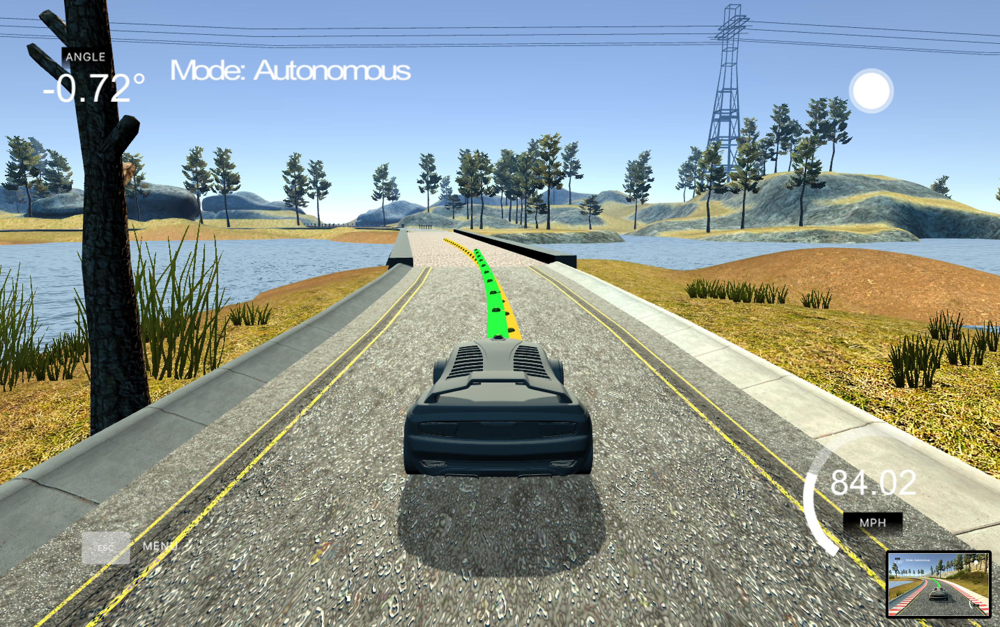

# CarND-Controls-MPC
Self-Driving Car Engineer Nanodegree Program

---

[](http://www.udacity.com/drive)

<figure>
 
 <figcaption>
 <p></p> 
 <p style="text-align: center;">Img: Model Predictive Controller in the Simulator. Yellow the vehicle path and in green the controller commands. </p> 
 </figcaption>
</figure>
 <p></p>

The project contains a Model Predictive Controller (MPC) that controls a vehicle longitudinal and lateral behavior by getting the Cross Track Error (CTE) of the position as well as the rotation error from a simulator and calculating out from there with cost-functions the desired balanced driving path for the feature steps. The Project contains following steps. 
1. Implementing the MPC in C++:
    1. Transforming the simulation global input to vehicle coordinates 
    2. Cross Track Error & Orientation Error
    3. Compensate the System-Latency (100ms)
    5.  Model Update (Kinematic Equations)
    6.  Model Constrains
2. Tuning the Cost-function for a smooth path
    1. Cost-functions 
    2. Plotting Errors for Debugging and tuning 
3.  Appendix
    1. Dependencies
    2. Build instruction
    3.  Additional study information
    
---
# 1) Function Development
In the following are the high lights of the project are presented for on overview. For more details feel free to check the code in the repository.

### 1.1 Translation & Rotation 
The car position is given in global coordination. To transform them into car coordination a translation and rotation is done by these [equation](http://planning.cs.uiuc.edu/node99.html).
 
 File `main.cpp` line 91.
 ```c
   for (int i = 0; i < ptsx.size(); i++) {
            double x_shift = ptsx[i] - px;
            double y_shift = ptsy[i] - py;
            
            // http://planning.cs.uiuc.edu/node99.html
            car_points_x.push_back(x_shift * cos(psi) + y_shift * sin(psi));
            car_points_y.push_back(y_shift * cos(psi) - x_shift * sin(psi));
          }
```

###  1.2 Calculating CTE & Orientation Error
We can express the error between the center off the road and the vehicle's position as the cross track error (CTE).  Assuming the reference line is a polynomial function and our CTE at the current state is defined as:

-y_{t})

File  `main.cpp`line 105.
 ```c
          // Fit 3rd order polynomials to waypoints. Fits most streets
          auto coeffs = polyfit(car_points_x_eigen, car_points_y_eigen, 3);

          // Cross Track Error CTE
          // positive value: too far to the right, negative too far to the left
          double cte = polyeval(coeffs, 0);

          // positive value: to far to the left, negative too far to the right
          double epsi = -atan(coeffs[1]);
```

### 1.3 Latency
In a real car, an actuation command won't execute instantly - there will be a delay as the command propagates through the system. A realistic delay might be on the order of 100 milliseconds. (This is also integrated into the simulator to make it as realistic as possible).
This is a problem called "latency", and it's a difficult challenge for some controllers - like a PID controller - to overcome. But a Model Predictive Controller can adapt quite well because we can model this latency in the system. A contributing factor to latency is actuator dynamics. For example the time elapsed between when you command a steering angle to when that angle is actually achieved. This could easily be modeled by a simple dynamic system and incorporated into the vehicle model.  To overcome this, the vehicle model calculates the fitting state after the latency. So that the actuator actually don't have a latency.

Conclusion, MPC can deal with latency much more effectively, by explicitly taking it into account, then a PID controller.

Here the code (file `main.cpp` line 125) for the start of the prediction of the MPC, to overcome the latency:
```c
dt = 0.1;
x1    = v * cos(0) * dt;
y1    = v * sin(0) * dt;
psi1  = - v/Lf * steer_value * dt;
v1    = throttle_value * dt;
cte1  =   v * sin(epsi1) * dt;
epsi1 = - v * steer_value / Lf * dt;	
```

### 1.4 Prediction Horizon

The prediction horizon is the duration over which future predictions are made. We’ll refer to this as T. T is the product of two other variables, ``N`` and ``dt``. ``N`` is the number of time-steps in the horizon. ``dt`` is how much time elapses between actuations. A good setting with the first shoot is  ``N`` were 10 and ``dt`` were 0.1, then T would be 1 seconds. 
* A general guideline is that T should be as large as possible, while ``dt`` should be as small as possible. For this shoot dt=0.1 is chosen, since this is the latency time and we currently make no difference in the time-steps we calculate the the model.  And T bigger than 1s didn't show any improvements. 

MPC attempts to approximate a continuous reference trajectory by means of discrete paths between actuations. Larger values of dt result in less frequent actuations, which makes it harder to accurately approximate a continuous reference trajectory. This is sometimes called "discretization error".

### 1.5 State

The state consists of system variables and errors references: ``[x,y,psi,v,cte,epsi]``. ``x`` and ``y`` stand for the vehicle position, ``psi`` the vehicle orientation, ``v`` the vehicle speed and finally, ``cte`` and ``epsi`` stand for the cross track error and orientation error of the vehicle related to the reference.

### 1.6 Model (Update equations)

The following equations updates the prediction model at every time-step:


``Lf`` measures the distance between the front of the vehicle and its center of gravity. ``f(x)`` is the evaluation of the polynomial ``f`` at point x and ``psidest`` is the tangential angle of the polynomial ``f`` evaluated at x.

### 1.7 Constraints

The actuators constraints limits the upper and lower bounds of the steering angle and throttle acceleration/brake.


The goal of Model Predictive Control is to optimize the control inputs: [δ,a]. An optimizer will tune these inputs until a low cost vector of control inputs is found. The length of this vector is determined by N:
 
 

## 2) Cost-functions & Tuning
 ### 2.1 Costfunction
 The cost functions are used to get a desired vehicle behavior. Designing them is difficult and getting them to cooperate to produce a reasonable vehicle behavior is even harder. One of the challenges is to solve problems without unsolving the old ones. So in code production these is done by regression test for every situation, to check of the desired behavior is there still the same.
  


For this project, following cost functions (file 'MPC.cpp' line 63)are used:

```c

	//Cost related to the reference state.
	for (unsigned int t = 0; t < N; t++) {
		fg[0] += 500000*CppAD::pow(vars[cte_start + t], 2); 
		fg[0] +=  50000*CppAD::pow(vars[epsi_start + t], 2); 
		fg[0] +=  10000*CppAD::pow(vars[v_start + t] - ref_v, 2); 
	}

	//Minimize the use of actuators.
	for (unsigned int t = 0; t < N - 1; t++) {
		//Increase the cost depending on the steering angle
	 	fg[0] += 50*CppAD::pow((vars[delta_start + t]/(0.436332*Lf))*vars[a_start + t], 2);
		fg[0] +=       CppAD::pow(vars[delta_start + t], 2);
	}

	//Minimize the value gap between sequential actuations.
	for (unsigned int t = 0; t < N - 2; t++) {
		fg[0] += 1000 *CppAD::pow(vars[delta_start + t + 1] - vars[delta_start + t], 2); 
		fg[0] +=            CppAD::pow(vars[a_start + t + 1] - vars[a_start + t], 2); 
	}
```
 ### 2.2 Tuning
 To make the results of the tuning visible a plot, figure 2.1, is used. The CTE gradient shows a steady and fast changing error in the system. A further tweak of the related cost-function could smoothen the behavior. Anyhow the car is most of the time quite stable with out big steering intervention, second plot. If they are happening the transition is smooth and never steep, thats positiv. In a further tuning the last small shakings between the 100 - 130 predictions should be more adjusted. Last but not least the last plot shows that the car never stops and the velocity is oscillating in the upper third between 50-90 mph anyhow with steep changes. If desired in further tuning this could also be more adjust.

<figure>
 
 <figcaption>
 <p></p> 
 <p style="text-align: center;"> Fig. 2.1: Data Evaluation, CTE-Error, Steering angle delta and last vehicle velocity</p> 
 </figcaption>
</figure>
 <p></p>

## 3) Appendix 
### 3.1 Dependencies

* cmake >= 3.5
 * All OSes: [click here for installation instructions](https://cmake.org/install/)
* make >= 4.1(mac, linux), 3.81(Windows)
  * Linux: make is installed by default on most Linux distros
  * Mac: [install Xcode command line tools to get make](https://developer.apple.com/xcode/features/)
  * Windows: [Click here for installation instructions](http://gnuwin32.sourceforge.net/packages/make.htm)
* gcc/g++ >= 5.4
  * Linux: gcc / g++ is installed by default on most Linux distros
  * Mac: same deal as make - [install Xcode command line tools]((https://developer.apple.com/xcode/features/)
  * Windows: recommend using [MinGW](http://www.mingw.org/)
* [uWebSockets](https://github.com/uWebSockets/uWebSockets)
  * Run either `install-mac.sh` or `install-ubuntu.sh`.
  * If you install from source, checkout to commit `e94b6e1`, i.e.
    ```
    git clone https://github.com/uWebSockets/uWebSockets
    cd uWebSockets
    git checkout e94b6e1
    ```
    Some function signatures have changed in v0.14.x. See [this PR](https://github.com/udacity/CarND-MPC-Project/pull/3) for more details.

* **Ipopt and CppAD:** Please refer to [this document](https://github.com/udacity/CarND-MPC-Project/blob/master/install_Ipopt_CppAD.md) for installation instructions.
* [Eigen](http://eigen.tuxfamily.org/index.php?title=Main_Page). This is already part of the repo so you shouldn't have to worry about it.
* Simulator. You can download these from the [releases tab](https://github.com/udacity/self-driving-car-sim/releases).
* Not a dependency but read the [DATA.md](./DATA.md) for a description of the data sent back from the simulator.


### 3.2 Basic Build Instructions

1. Clone this repo.
2. Make a build directory: `mkdir build && cd build`
3. Compile: `cmake .. && make`
4. Run it: `./mpc`.

### 3.3 Additional study material

Here are some resources you might want to refer to for more insight on the subject matter of this project, this resources are listed from this [Readme](https://github.com/MarkBroerkens/CarND-MPC-Project/blob/master/README.md).

* [MPC Overview, Selection of Design and Tuning Parameters](http://www.cc.ntut.edu.tw/~jcjeng/Model%20Predictive%20Control.pdf)
* [Multivariable, Model-Predictive Advanced Process Controller](https://minds.wisconsin.edu/handle/1793/10886)
* [Tutorial overview of model predictive control 1](https://minds.wisconsin.edu/handle/1793/10886)
* [Linear Model Predictive Control Stability and Robustness](http://www.control.isy.liu.se/research/reports/LicentiateThesis/Lic866.pdf)
* [Course on Model Predictive Control Part II – Linear MPC design 1](http://www.centropiaggio.unipi.it/sites/default/files/course/material/2_MPCcourse_linearMPC_design.pdf)
* [A Tutorial on Model Predictive Control for Spacecraft Rendezvous 2](https://www.repository.cam.ac.uk/bitstream/handle/1810/247957/Hartley%202015%20European%20Control%20Conference%202015.pdf?sequence=1&isAllowed=y)
* [Explicit Model Predictive Control](https://www.kirp.chtf.stuba.sk/pc11/data/workshops/mpc/MPC_PC11_Lecture2.pdf)
* [Model predictive control, Prof. Alberto Bemporad](http://cse.lab.imtlucca.it/~bemporad/teaching/ac/pdf/AC2-10-MPC.pdf)
* [A Lecture on Model Predictive Control 2](http://cepac.cheme.cmu.edu/pasilectures/lee/LecturenoteonMPC-JHL.pdf)
* [A tutorial review of economic model predictive control methods 1](http://www.sciencedirect.com/science/article/pii/S0959152414000900)
* [Model Predictive Control (MPC), Bo Bernhardsson and Karl Johan Åström, Department of Automatic Control LTH, Lund University 1](http://www.control.lth.se/media/Education/DoctorateProgram/2016/Control%20System%20Synthesis/MPC.pdf)


